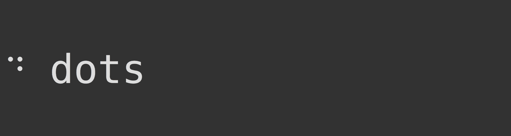

# CliSpinners



## Installation

Install from [Hex](https://hex.pm/docs/publish), Package Manger.
by adding `cli_spinners` to your list of dependencies in `mix.exs`:

```elixir
def deps do
  [{:cli_spinners, "~> 0.1.0"}]
end
```

and published on [HexDocs](https://hexdocs.pm/cli_spinners/CliSpinners.html).

## Demo
To see all the demos in your terminal, just load the library in your `iex` shell and call a definition `demo`

```elixir

iex> CliSpinners.demo()

```
Here, each animation is played for `two` seconds. You can break that by pressing `Ctrl C` twice. You will return to your shell again.

# Documentation for CliSpinners.
CliSpinners are nothing more like a loading animation in the command line
interface.

This module comes with different flavours of loading spins. The following is the
list of flavours you can pass


## Loading Flavors

### dots
The dots  flavor comes with **12** combnations of loading animations.
From `dots` to `dots12`.
```python
dots
dots2
dots3
.....
.....
dots12
```
There is no `dots1`. Here, `dots1` is written as just `dots` .

### line
Line comes with two combinations
* `line`
* `line2`

### pipe
* `pipe`

### simple_dots
* `simple_dots`
* `simple_dots_scrolling`

### star
* `star`
* `star2`

### flip
* `flip`

### hamburger
* `hamburger`

### grow
This grow format comes in two flavors
* `grow_vertical`
* `grow_horizontal`

### balloon
* `balloon`
* `balloon2`

### noise
* `noise`

### bounce
* `bounce`

### box_bounce
* `box_bounce`
* `box_bounce2`

### Geometry
* `triangle`
* `circle`
* `arc`
* `circle`
* `circle_quarters`
* `square_corners`
* `circle_halves`

### squish
* `squish`

### toggle
This **toggle** flavor comes in 13 flavors
```js
toggle
toggle1
toggle2
.....
toggle13
```

### arrow
* `arrow`
* `arrow2`
* `arrow3`

### bouncing
* `bouncing_bar`
* `bouncing_ball`

### smiley
* `smiley`

### monkey
* `monkey`

### hearts
* `hearts`

### clock
* `clock`

### earth
* `earth`

### moon
* `moon`

### pong
* `pong`

### runner
* `runner`

### shark
* `shark`

### dqpb
* `dqpb`


Giff Credits [Sindresorhus](https://raw.githubusercontent.com/sindresorhus/cli-spinners/master/screenshot.gif) Npm Package

Inspiration from [Progessbar](https://github.com/henrik/progress_bar):


Thanks for Reading.

### Support

Buy me a cup of coffee https://paypal.me/ankanna
